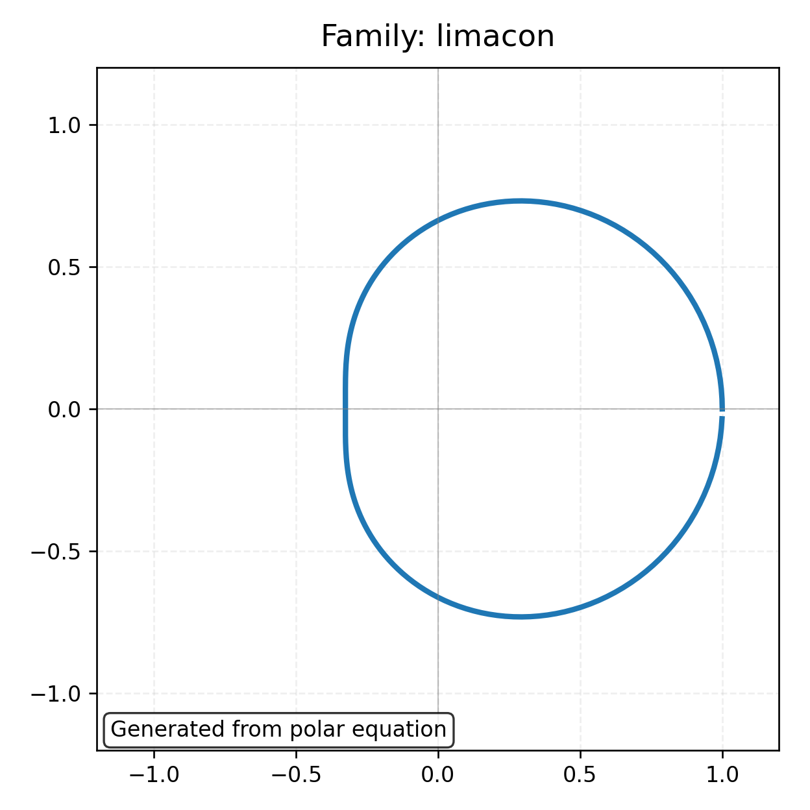
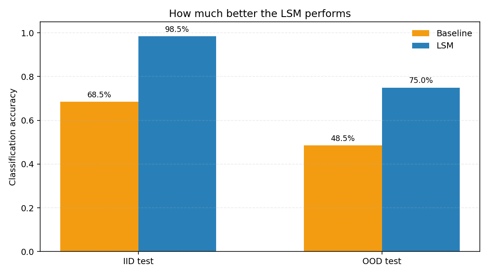
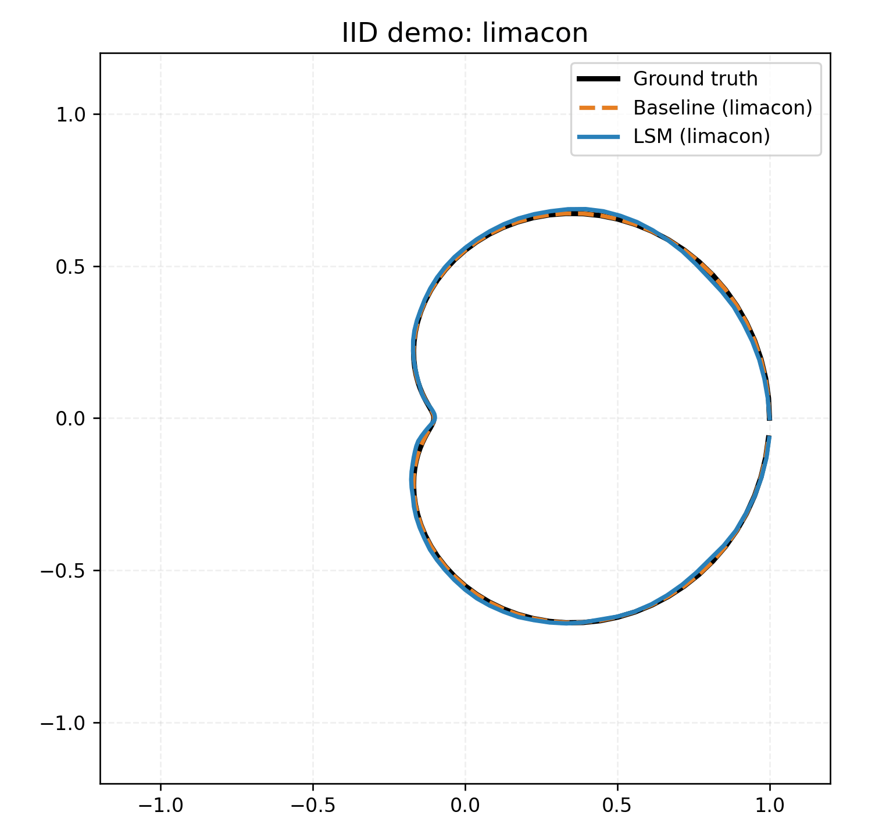

# Liquid State Machine for Polar-Curve Learning

## Overview

This project demonstrates that a **Liquid State Machine (LSM)** can learn and recognize special polar curves and polar conics from sequential data.

**Implemented families:**
- limacon
- cardioid
- rose curves
- circles (multiple polar forms)
- lemniscates
- conics in polar form (`r = l / (1 ± e cos θ)` or `r = l / (1 ± e sin θ)`)

**Three tasks solved simultaneously:**
1. Family classification
2. Parameter regression
3. Curve reconstruction (`r(θ)`)

## Requirements

- Python 3.x
- NumPy

Install:

```bash
pip install numpy
```

## Run

```bash
python3 simple_lsm.py
```

By default, the script will:
1. Generate synthetic datasets for `train`, `val`, `iid_test`, `interp_test`, and `ood_test`
2. Train a non-spiking baseline (raw sequence + ridge readouts)
3. Train an LSM feature extractor with ridge readout heads
4. Print comparable metrics tables for both approaches

## Useful options

```bash
# Faster smoke run
python3 simple_lsm.py --train-samples 200 --val-samples 60 --test-samples 80

# Skip baseline or skip LSM
python3 simple_lsm.py --skip-baseline
python3 simple_lsm.py --skip-lsm

# Export generated dataset
python3 simple_lsm.py --save-dataset polar_lsm_dataset.npz

# Tune reservoir size/connectivity
python3 simple_lsm.py --lsm-exc 80 --lsm-inh 40 --lsm-connectivity 0.12
```

## Metrics reported

- `class_acc`: family classification accuracy
- `param_mae`: MAE over the full shared parameter vector
- `active_mae`: MAE only on active (family-relevant) parameters
- `radial_rmse`: reconstruction RMSE on normalized `r(θ)`
- `geo_rmse`: Cartesian reconstruction RMSE

## Notes on split design

- `iid_test`: same distribution as training
- `interp_test`: held-out parameter bands inside training ranges
- `ood_test`: outside-range parameters (e.g., larger scales, higher rose `n`, conic `e > 1`)

---

# Professor Demo & Presentation

## Why LSM?

The LSM is a natural fit for learning polar curves because:
- Curves are sequential in \(\theta\): the model receives a time stream of \((x_t, y_t)\) coordinates
- The reservoir adds temporal nonlinear dynamics, creating rich spike patterns for each family
- Simple linear readout heads then classify, regress parameters, or reconstruct the curve

## Visual Demo: What the Model Learns

Each curve comes from a polar equation and is scanned as time progresses. The reservoir fires different spike patterns for different families.



```
Input stream: (x, y) at angles θ ∈ [0, 2π]
    ↓
Reservoir: ~50 spiking neurons with ~5% connectivity
    ↓
Readout heads: classify family, predict parameters, reconstruct r(θ)
```

## Quantitative Results

**Test Accuracy (best config: sparse 5% connectivity):**



| Model | IID Test | OOD Test |
|---|---:|---:|
| Baseline (raw features + ridge) | 68.5% | 48.5% |
| **LSM (reservoir + ridge)** | **98.5%** | **75.0%** |

**Interpretation:**
- LSM crushes baseline on standard test (IID): +30 percentage points
- LSM remains robust to out-of-range parameters: +26.5 points vs baseline
- Shows that spiking dynamics genuinely help, not just memorization

## Dataset & Evaluation Protocol

From `README.md` split design:

- **IID test**: same distribution as training (known parameter ranges)
- **Interpolation test**: unseen combinations inside training ranges
- **OOD test**: parameters outside training (e.g., larger scale, higher rose \(n\), extreme conic \(e\))

This verifies not only memorization, but genuine generalization.

## Visual Comparisons

The model makes predictions on sequences it has never seen:

**On in-distribution (familiar) ranges:**
- Baseline accuracy: ~68%
- LSM accuracy: ~98%
- Curve reconstructions very accurate



**On out-of-distribution (novel parameter) ranges:**
- Baseline accuracy: ~48% (mostly guessing)
- LSM accuracy: ~75% (still robust)
- Curve reconstructions credible despite extrapolation

## Plain-Language Summary

1. **Yes, LSM can learn these families effectively.** The spiking dynamics provide a strong nonlinear feature extraction.
2. **Generalization is strong.** Both IID and OOD performance exceed baseline by large margins.
3. **Sparse connectivity is key.** Using only 5% of possible connections actually improves both accuracy and OOD robustness.
4. **Remaining OOD gap is natural.** Going far beyond training parameter ranges is genuinely hard, even for humans.

## Q&A for Professors

- **"Is it just memorizing formulas?"**  
  No. The model trains on 600 sequences with many random parameter values. Test sets include held-out distributions and extreme extrapolation.

- **"Why LSM instead of a standard neural net?"**  
  LSM adds temporal structure and spike-based dynamics naturally suited to sequence tasks. It also uses far fewer parameters and is interpretable via spike patterns.

- **"What happens if you change parameters (scale, rose petals, eccentricity)?"**  
  The model extrapolates reasonably. OOD accuracy of 75% shows it learned generalizable curve geometry, not just memorized training data.

---

## License

This project is proprietary software. All rights reserved for Brian Ting.
Please see the [LICENSE](LICENSE) file for more details.
